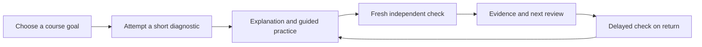
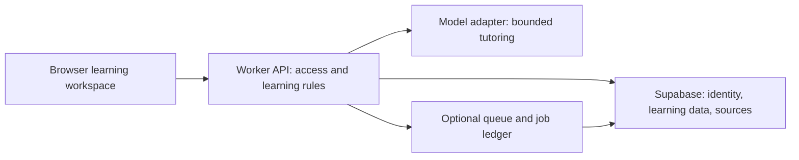

# Rawi research and product strategy

Rawi should begin as an English-first learning workspace for a small group of UAE college students taking the same course. Its promise should be concrete: **understand a concept, solve a fresh problem independently, and remember it later**. Build one complete version of that experience, observe real learners using it, and extend the product from the resulting evidence.

The recommended initial cohort is 10–20 learners aged 18–24, drawn from the founder's existing college contacts. The broader audience includes 17-year-old college students and high-school students aged 13–19, but serving minors should be a later, explicitly designed release. Introductory microeconomics is a useful demonstration subject; the actual pilot course must follow recruitment overlap, content permissions, and reviewer availability.

The recommended engineering approach is a single TypeScript codebase with React/Vite, a lightweight Cloudflare Worker API, Supabase Free, and a bounded model integration. Hosting can remain at zero cost for a limited pilot within verified free-tier constraints. Reliability practices should be implemented from the beginning, while availability and capacity promises remain proportionate to those services.

## Founder constraints and the resulting choices

| Confirmed constraint | Consequence |
|---|---|
| Real product and small pilot | Prioritize learner access, repeated use and credible evidence over feature count |
| Solo developer, 20+ hours/week | Use managed foundations, small complete slices and one integration owner |
| UAE college contacts across social science, business/economics and introductory sciences | Select a shared course; do not default to computer science merely because the founder is a software engineer |
| English primary; Arabic welcome | Launch English first, preserve room for reviewed Arabic explanations and RTL later |
| Zero hosting/deployment spend | Use free services, a provider subdomain, bounded usage and explicit stop conditions |
| Willingness to pay for AI/development | Spend on measured tutor quality and useful agent work; separate product API bills from development subscriptions |

The full product can eventually include multiple courses, private material uploads, adaptive practice, visual explanations, and age-appropriate teen support. The first release should establish a trustworthy learning system whose behavior is easy to inspect and improve.

## Competitive reality

The category already has capable products. ChatGPT Study Mode provides guided questions, explanations and understanding checks; Google's NotebookLM, now labeled Gemini Notebook in its live help, combines source-based study with citations and learning materials. These make a generic upload-and-chat proposition difficult to distinguish. [1][2]

Khanmigo combines tutoring with an established curriculum. Quizlet and StudyFetch offer broad study workflows, including practice and material transformation. Feature descriptions establish what vendors advertise, not which product produces superior educational outcomes. The detailed [competitive memo](market.md) compares five products, verified access/pricing information, and source limitations. [3][4][5]

Rawi's potential advantage is specific execution for a reachable learner community: accurately identifying a recurring misconception, offering useful practice aligned to their course, and showing what they can do without assistance. None of these is an established moat. The founder must observe whether learners choose Rawi over their current free tool when studying the same material.

Avoid using general AI adoption statistics or UAE investment announcements as evidence of willingness to pay. The available sources do not establish Rawi's market size, conversion, retention, or acquisition cost. A small local cohort is a way to learn those things, not a proxy for a large market forecast.

## Choosing the first course

| Candidate | Strength for this founder | Main difficulty | Recommendation |
|---|---|---|---|
| Introductory microeconomics/business unit | Mix of concepts, scenarios, charts and bounded calculations; fits reported contacts | Ambiguous wording and assumptions can produce misleading feedback | Provisional demonstration subject |
| Shared social-science or general university course | Strong fit if several students use the same readings and rubric | Interpretive answers are harder to grade; source permissions matter | Equally valid if recruitment overlap is stronger |
| One math/physics/statistics unit | Independent performance can be checked on constrained problems | Notation, units, equivalent methods and diagrams increase review effort | Choose with a strong reviewer and shared learner need |
| Introductory biology/chemistry unit | Specific misconceptions and factual relationships can be practiced | Scientific accuracy, images and misleading simplifications | Viable after narrowing to one reviewed unit |

Use a practical discovery gate: speak to 8–12 learners, identify at least five adults with the same course or aligned unit, and recruit a subject-competent reviewer. This is enough to select a discovery prototype; before the full pilot, aim for 10–20 participants, with at least eight sharing the core unit. If course overlap is weak, change the course or recruitment route before adding features.

For a microeconomics demo, use original scenarios about opportunity cost and a shift in demand versus movement along a curve. Simple elasticity questions can follow, with the percentage-change method, sign convention and rounding stated. Do not build the first experience around unrestricted essays, scanned textbooks, or complete exam prediction.

## Learning evidence and its limits

Experimental findings favor careful instructional design over assuming any conversational model will teach well. A Harvard physics trial found improved immediate outcomes for a purpose-built tutor, while a Turkish high-school mathematics trial found that unguarded assistance could improve practice performance yet harm later unaided results. Their populations, interventions and comparisons differ. [6][7]

The studies do not establish Rawi's effectiveness, long-term retention, or results for UAE learners. The [learning evidence memo](learning.md) examines these limitations, updated human–AI tutoring results, newer preprints, retrieval practice, spacing and worked examples. It distinguishes promising estimates from convincing evidence and assisted task performance from acquired skill.

The design implication is a coherent sequence:

Support should adapt to the learner's attempt. A novice may need a worked example immediately; a more experienced learner may need one focused hint. Repeatedly demanding guesses is poor interaction design. Let learners ask for explanations, and record when assistance was used.

The core progress object is a concept with evidence: not checked, practicing, independent once, or retained on review. The model may propose a misconception, but application rules control status. A correct answer after a reveal must not count as independent success. A fresh delayed check supplies stronger evidence than a long conversation or a confidence score.

## First-release scope

The complete local slice should include one original lesson, an attempt, a helpful fixture tutor response, a fresh check, and an evidence summary. This makes the product reviewable before expensive integrations. The actual course can be swapped when discovery identifies a stronger choice.

The adult private pilot adds managed login, saved learning records, real AI tutoring, a small reviewed source pack, citation navigation, a review queue, error reporting, export/deletion and usage controls. A source pack can be prepared locally. Personal uploads are an extension if they prove necessary, rather than a prerequisite for every learner to experience value.

Defer native mobile apps, real-time voice, social feeds, institutional dashboards, proctoring, automatic grading for official credentials, broad subject coverage and unrestricted autonomous tools. Add those only when they address observed learner needs and the system can support them. The [product specification](../docs/PRODUCT.md) defines the exact modes and proposed pilot gates.

Source rights deserve early attention. Access to course slides is not permission to republish or send them to a model provider. Build with original material or documented permission and keep private uploads private. A publicly readable textbook should not silently become the production retrieval corpus.

## Architecture and AI design

Use React/Vite for the learner interface and a small Hono API on Cloudflare Workers. Supabase provides managed identity, Postgres and private file storage. Keep ordinary relational data for courses, source versions, concepts, attempts, reviews and usage. Begin retrieval with course-scoped lexical search; compare semantic retrieval on actual questions before adding complexity. [8][9]

For each tutor request, authorize the session, reserve cost, load permitted context, call the model, validate its result, and commit an idempotent outcome. A model response cannot grant access, change a budget or declare an independent check passed by itself. Citation validation must check both the existence of a source reference and whether it supports the explanation.

The production check bank and unrevealed answers belong on the server. Separate assisted practice from independent assessment even if they share interface components. Version the prompt, model configuration, source pack and grading rubric so a bad release can be diagnosed.

Evaluate a lower-cost and a stronger model on the selected course. Choose the least expensive adult configuration that clears quality requirements. Keep a small provider adapter, but implement only one provider initially. Fallback models require evaluation too. Maintain test cases in the repository and make paid evaluation runs explicit and bounded.

The [architecture memo](architecture.md) specifies API failure handling, free runtime limitations, auth onboarding, optional queues, source ingestion, cost accounting and recovery. It also explains why a managed database and a small application are a better fit for this pilot than a distributed collection of services.

## Zero hosting cost and a realistic AI budget

Cloudflare Workers Free and Supabase Free are a plausible deployment basis for an invitation pilot. Their free limits must determine upload volume, cohort size and operational promises. Supabase can pause low-activity free projects and does not provide the automatic backups of its paid service. Manual encrypted backups and a restore rehearsal remain necessary. [8][9][10]

Stay on Free plans, use the included provider address, and enable no paid add-ons or automatic upgrades. If limits are approached, pause new enrollment or reduce workload. Do not substitute a paid service without revisiting the founder's explicit constraint. The free-tier architecture is conditional on current terms and capacity, not a promise that unlimited growth will remain free.

The architecture memo's dated token example gives an illustrative $0.132 for twenty calls using 4,000 input and 800 billable output tokens each on GPT-5.4 Mini. At twenty learners and eight such sessions/month, that is $21.12 in those calls. This is a budgeting example, not a measured Rawi cost or a model selection. Larger models, grading, retries, embeddings and evaluation add cost. [11]

For initial planning, a $30–60 monthly AI envelope is a proposal worth testing for this small cohort; it is not authorized spend. The founder must choose the actual ceiling. Budget development evaluations separately and log all attempts, including failures. Reserve budget atomically before requests so several simultaneous calls cannot independently spend the same remaining allowance.

Claude Pro, OpenAI Plus/credits and the Google subscription are useful development resources. Their exact product API entitlements have not been established. OpenAI's documentation distinguishes subscription access from usage billed through the API platform; verify where the 1,500 credits apply rather than treating them as API dollars. [12]

## UAE and teen expansion

The first cohort should use the 18–24 subset of the college audience. Seventeen-year-old college students are not silently included. The UAE's newer child digital safety framework makes age handling, privacy and content protections material design questions for expansion. An educational label does not establish an exemption. [13]

Before real learner data is collected, document the applicable UAE data regime, vendor processing locations, transfer basis, retention, support access and deletion. Before teens join, confirm the current classification and implementing requirements, then implement and test age-appropriate safeguards and support. The [safety and data plan](../docs/SAFETY.md) records the researched issues and direct-source access limitations. It does not claim legal clearance or UAE-only data residency.

Keep Arabic in the architecture through translatable messages and logical CSS, but validate terminology and educational quality with bilingual reviewers before offering it. One good English course is a stronger starting test than several uneven bilingual subjects.

## Validation, distribution and commercial direction

Recruit through the founder's real UAE student contacts and permitted course communities. Observe how learners currently study before pitching features. The [discovery protocol](../docs/DISCOVERY.md) contains ten behavioral questions and a counterbalanced comparison with the participant's existing free tool.

Measure completion without founder help, a meaningful second-day return, independent fresh-item performance, delayed performance, recurring tutor defects and cost per completed loop. Record denominators, missing follow-ups, external study and prompted versus voluntary returns. Ten to twenty learners can reveal usability failures and preliminary signals; they cannot establish broad causal educational efficacy.

If learners enjoy the explanation but fail fresh problems, improve the teaching and practice sequence. If they succeed once but do not return, examine the recurring need and review experience. If they cannot provide a reason to choose Rawi over their existing tool, revisit the value proposition before adding breadth.

Keep the first pilot free. After repeat value is observed, compare a bounded monthly allowance with a course or assessment-period pass. Test a concrete offer in AED with an honest description of its limits; do not infer purchase behavior from compliments. A checkout implementation, payment-provider terms, and any business requirements belong to a later monetization decision.

## Delivery and engineering growth

Use an 8–12-week planning envelope at 20+ founder hours/week, then reforecast after the first local slice. The [delivery backlog](../docs/DELIVERY.md) breaks work into dependencies and acceptance evidence. Discovery and content review happen alongside development; the pilot includes time for a delayed check.

| Capability to develop | Rawi work that demonstrates it |
|---|---|
| Product engineering | A complete learning flow improved through observed learner behavior |
| Backend design | Versioned learning records, transactions, idempotency and quotas |
| Security | Account isolation, private sources, malicious-document tests and deletion |
| Applied AI | Source retrieval, structured responses, model comparisons and failure analysis |
| Reliability | Timeouts, job recovery, free-tier exhaustion, backup and restore |
| Quality practice | Deterministic tests, human-calibrated AI evaluations and held-out learning checks |
| Technical communication | Decision records, small reviewed changes and a defensible public case study |

The recommended session pattern is specification, complete slice, verification, independent review, learner observation, and the next slice. One integration owner coordinates bounded implementation agents. The [agent playbook](../docs/AGENT_PLAYBOOK.md) provides reusable implementation/review prompts and the exact first-session brief.

At each milestone, the founder should be able to explain the important request path, state rule or failure mode. An architecture diagram, an honest evaluation report, a restore rehearsal and evidence of learner-driven improvements provide stronger demonstrations of engineering depth than a large feature list alone.

## Evidence scope and sources

Research was reviewed on 13 September 2026. Product comparisons use official descriptions; empirical claims use original studies where accessible. Pricing and service behavior are dated observations and need rechecking at setup. Recommendations, time estimates and pilot gates are analytical proposals. No learners have been interviewed, no app benchmark has been run, and no product efficacy or market demand has been established.

Detailed sources and limitations are preserved in the [market memo](market.md), [learning memo](learning.md), [architecture memo](architecture.md), and [safety plan](../docs/SAFETY.md). The [source index](SOURCES.md) links the pack's external references.

1. OpenAI. [Using study mode in ChatGPT](https://help.openai.com/en/articles/11780217-chatgpt-study-mode-faq). Living help documentation.
2. Google. [Learn about Gemini Notebook](https://support.google.com/gemininotebook/answer/16164461?hl=en). Living help documentation.
3. Khan Academy. [Khanmigo for parents](https://www.khanmigo.ai/parents). Living product page.
4. Quizlet. [Subscribing to Quizlet](https://help.quizlet.com/hc/en-us/articles/360041181691-Subscribing-to-Quizlet). Living help documentation.
5. StudyFetch. [Product homepage](https://www.studyfetch.com/). Living vendor description.
6. Kestin et al. [AI tutoring outperforms in-class active learning](https://www.nature.com/articles/s41598-025-97652-6). Scientific Reports, 2025. Interpretation and limits in learning memo.
7. Bastani et al. [Generative AI without guardrails can harm learning](https://doi.org/10.1073/pnas.2422633122). PNAS, 2025. Interpretation and correction in learning memo.
8. Cloudflare. [Workers limits](https://developers.cloudflare.com/workers/platform/limits/). Living documentation.
9. Supabase. [Pricing](https://supabase.com/pricing). Living plan comparison.
10. Supabase. [Database backups](https://supabase.com/docs/guides/platform/backups). Living documentation.
11. OpenAI. [GPT-5.4 Mini model pricing](https://developers.openai.com/api/docs/models/gpt-5.4-mini). Living model documentation; illustrative arithmetic only.
12. OpenAI. [Authentication](https://learn.chatgpt.com/docs/auth). Living documentation distinguishing subscription and API access.
13. UAE Government. [Child Digital Safety decree-law overview](https://uaelegislation.gov.ae/en/news/uae-government-issues-a-federal-decree-law-on-child-digital-safety). 26 December 2025. Indexed official text; direct access restriction disclosed in safety plan.
